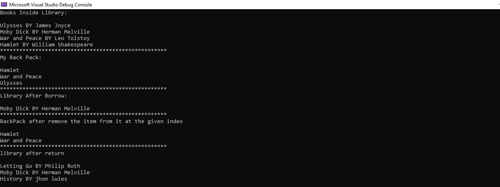

# Lab8-PhilsLendingLibrary

### This is a C# console app that uses multiple classes and a generic collection to create a basic lending library with functionality for adding, borrowing and removing books from the library.

## Add

To add a book , you can use Add method , that takes 4 parameters , which are title (string) ,
author first name (string) , author last name (string) and pages number (int) .

## Borrow

 To obtain or receive (Book) on loan , that takes 1 parameters , which are title (string)

## Return

To return a book , you can use Return method , that takes 1 parameter , which is Book (Book)

## Pack

To pack a book , you can use Pack method , that takes 1 parameter , which is (item)

## UnPack

To unpack a book , you can use Unpack method , that takes 1 parameter , which is (index)

## to run the program

1- Clone repo

2- To run the app press ctrl + F5

## Result

